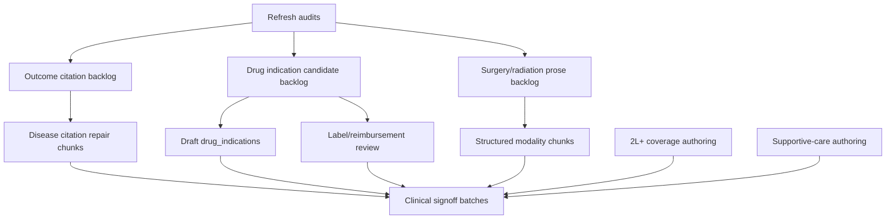

# Audit Remediation Deep Plan

**Status:** v0.1 started, 2026-05-07. This plan turns the six open audit
findings into coordinated workstreams. It is intentionally operational:
each stream has a baseline, first artifact, chunking rule, quality gate,
and acceptance target.

Primary audit inputs:

- `docs/audits/expected_outcomes_traceability_2026-05-01.md`
- `docs/audits/clinical_gap_audit.md`
- `docs/kb-coverage-matrix.md`

Related implementation now in place:

- `knowledge_base/schemas/indication.py` supports citation-bearing
  `OutcomeValue` records.
- `knowledge_base/schemas/drug_indication.py` defines label/off-label and
  reimbursement metadata.
- `knowledge_base/schemas/modality.py` defines structured surgery and
  radiation modality records.
- `scripts/audit_expected_outcomes.py`,
  `scripts/backfill_drug_indications.py`, and
  `scripts/audit_modality_structure.py` produce the first machine-readable
  queues once Python is available.

## Executive Baseline

| Stream | Baseline | Target | First output |
|---|---:|---:|---|
| 1. Expected outcomes citation repair | 100/1070 strict-cited; 902 uncited; 68 probably-cited | >=90% strict-cited populated outcomes | `expected_outcomes_traceability_2026-05-01_backlog.json` |
| 2. Drug indication label/access tracking | 654 inferred pairs; 0 explicit label/off-label rows | 100% draft rows, then reviewed status for high-priority pairs | `drug_indication_backfill_candidates.json` |
| 3. Surgery/radiation structure | 344 prose mentions; 0 structured rows | Structured records for every clinically material prose mention | `modality_structure_audit.json` |
| 4. Clinical signoff | 15/1726 reviewed, 0.9% | >=85% before public guideline-grade claims | Reviewer batch queue |
| 5. Solid tumor 2L+ coverage | 21/42 solid diseases lack 2L+ algorithm; 18/42 lack 2L+ indication | Every modeled solid disease has >=1 advanced/relapsed indication and algorithm | Disease authoring queue |
| 6. Supportive-care depth | 120 regimens missing mandatory supportive care | Every active regimen has care, monitoring, dose adjustment, watchpoints | Risk-ranked regimen queue |

## Program Rules

1. No new clinical value is accepted without a source path.
2. Unknown is allowed when explicit; silent blanks are not.
3. Generated rows start as `draft: true`.
4. Reviewer signoff is a governance gate, not something code can fake.
5. Local modality records are render/audit/governance metadata; they must
   not make autonomous treatment-selection decisions.
6. Work is chunked small enough for clinical review: usually <=10
   indications, <=25 drug-use pairs, or <=20 regimens per chunk.

## Dependency Map



## Day-0 Bootstrap

These commands should be run as soon as Python/pytest are available:

```powershell
python scripts/audit_expected_outcomes.py
python scripts/backfill_drug_indications.py --report
python scripts/audit_modality_structure.py
python scripts/audit_clinical_gaps.py
python scripts/kb_coverage_matrix.py
python -m knowledge_base.validation.loader knowledge_base/hosted/content
pytest tests/test_expected_outcomes_audit.py tests/test_drug_indication_schema.py tests/test_modality_schema.py tests/test_loader.py
```

Expected generated files:

- `docs/audits/expected_outcomes_traceability_2026-05-01_backlog.json`
- `docs/audits/drug_indication_backfill_candidates.json`
- `docs/audits/modality_structure_audit.json`
- refreshed `docs/audits/clinical_gap_audit.md`
- refreshed `docs/kb-coverage-matrix.md`

## Stream 1: Expected Outcomes Citation Repair

### Baseline

The 2026-05-01 audit found:

- 312 indications audited.
- 1070 populated outcome-field cells.
- 100 strict-cited cells, 9.3%.
- 68 probably-cited cells, 6.4%.
- 902 uncited cells, 84.3%.

Worst-offender disease order by uncited cells:

1. `DIS-CRC`: 55 uncited
2. `DIS-NSCLC`: 52 uncited
3. `DIS-AML`: 51 uncited
4. `DIS-OVARIAN`: 42 uncited
5. `DIS-DLBCL-NOS`: 30 uncited

### First Work

Generate the JSON backlog, then start Wave A on the top five diseases. Do
not attempt all 902 cells in one pass. For each populated value:

1. Identify the trial/guideline source that supports the exact outcome.
2. Reuse or create a `SRC-*` entity with PMID/DOI/journal/year when
   available.
3. Convert scalar outcomes into:

```yaml
progression_free_survival:
  value: "Median PFS 10.6 months"
  source: SRC-...
  source_refs: [SRC-...]
```

4. Leave values null only when the selected source does not report the
   endpoint; add a short note explaining why.

### Chunking

| Wave | Scope | Max size | Goal |
|---|---|---:|---|
| A | CRC, NSCLC, AML, ovarian, DLBCL | <=10 indications/chunk | Remove the largest uncited pools |
| B | Melanoma, FL, PV, B-ALL, MM, breast, CLL | <=10 indications/chunk | Move strict-cited above 50% |
| C | Remaining diseases | 1 disease/chunk | Reach >=90% strict-cited |

### Quality Gate

- Audit rerun shows changed cells moved from `uncited` or
  `probably-cited` to `cited`.
- No invented `SRC-*`, PMID, DOI, or trial readout.
- `SRC-LEGACY-UNCITED` remains only for explicitly deferred cells.
- Clinical reviewer can trace every changed value to a source in one hop.

## Stream 2: Drug Indication Label, Off-Label, and Reimbursement Tracking

### Baseline

The clinical gap audit inferred 654 drug-disease-indication pairs from
regimen components. None currently carry explicit label/off-label or
reimbursement status.

### First Work

Run:

```powershell
python scripts/backfill_drug_indications.py --report
```

Then review the candidate report before writing YAML. The first content
chunk should use `--write-yaml` only after checking candidate IDs and
deduplication.

### Data Contract

Each row represents one drug in one clinical context:

- `drug_id`
- `disease_id`
- optional `indication_id`
- optional `regimen_id`
- `label_status`
- `reimbursement_status`
- jurisdiction-specific `regulatory_statuses`
- payer-specific `reimbursement_statuses`
- `evidence_source_refs`

Generated rows stay:

```yaml
draft: true
label_status: unknown_pending_review
reimbursement_status: unknown_pending_review
```

until a reviewer checks the label/access evidence.

### Chunking

| Wave | Scope | Max size | Goal |
|---|---|---:|---|
| A | Generate draft rows for all candidates | all candidates, mechanical | Make the relationship first-class |
| B | Top disease/regimen pairs: NSCLC, breast, CRC, ovarian, DLBCL | <=25 pairs/chunk | Verify label/off-label status |
| C | Ukraine/NSZU reimbursement | <=25 pairs/chunk | Verify patient access metadata |
| D | Remaining pairs | <=50 pairs/chunk | Reach full coverage |

### Quality Gate

- Every reviewed status has at least one source ref.
- FDA/EMA/Ukraine label status is not collapsed into one global truth.
- Reimbursement status names payer/jurisdiction and `current_as_of`.
- Off-label statuses distinguish guideline-supported from investigational.

## Stream 3: Surgery and Radiation Structure

### Baseline

The clinical gap audit found 344 indications with surgery/radiation
mentions in prose and no structured surgery/radiation entities.

### First Work

Run:

```powershell
python scripts/audit_modality_structure.py
```

Then split `modality_structure_audit.json` into surgery and radiation
queues. The first content chunk should not author clinical modality records
from keyword hits alone; keyword hits are a triage queue.

### Data Contract

Surgery records must capture:

- disease
- indication links
- intent
- procedure
- timing
- selection criteria
- required tests
- source refs

Radiation records must capture:

- disease
- indication links
- intent
- site
- technique
- dose/fractionation when known
- organs at risk
- concurrent systemic therapy when applicable
- source refs

### Chunking

| Wave | Scope | Max size | Goal |
|---|---|---:|---|
| A | CRC, breast, NSCLC, ovarian, cervical, anal | <=10 indications/chunk | Cover common local-therapy patterns |
| B | CNS, HNSCC, prostate, esophageal, gastric | <=10 indications/chunk | Add specialist-heavy modality records |
| C | Rare diseases and palliative local therapy | 1 disease/chunk | Complete remaining prose candidates |

### Quality Gate

- Every record is linked to at least one indication or explicitly marked as
  disease-level.
- Dose/fractionation is populated only when source-backed.
- Records stay `draft: true` until surgery/radiation reviewer approval.
- Engine behavior does not change.

## Stream 4: Clinical Signoff

### Baseline

Clinical gap audit: 15 of 1726 signoff-eligible entities reviewed, 0.9%.
This is the largest governance blocker.

### First Work

Create reviewer packets rather than asking reviewers to scan the entire KB.
Each packet should include:

- entity IDs
- changed fields
- source refs
- known unresolved questions
- pass/fail checklist
- target reviewer role

### Batch Order

| Batch | Entity family | Why first |
|---|---|---|
| 1 | Outcome-citation repaired indications | High clinical visibility |
| 2 | BMA records with ESCAT/CIViC evidence | High decision impact |
| 3 | Red flags and contraindications | Safety-critical |
| 4 | Drug indications with label/access status | Patient access and off-label risk |
| 5 | Surgery/radiation records | Specialist review needed |
| 6 | Supportive care and monitoring | Patient safety and toxicity |

### Quality Gate

- Two qualified reviewer signoffs required for guideline-grade claims.
- One reviewer signoff can mark "ready for second review"; it does not
  remove public-facing caution language.
- Signoff records must include date, reviewer ID, scope, and rationale.

## Stream 5: Solid Tumor 2L+ Coverage

### Baseline

Clinical gap audit:

- 21 of 42 solid diseases lack a 2L+ algorithm.
- 18 of 42 solid diseases lack a 2L+ indication.

Missing 2L+ algorithm rows include:

`DIS-ANAL-SCC`, `DIS-BCC`, `DIS-CERVICAL`, `DIS-CHONDROSARCOMA`,
`DIS-EPITHELIOID-SARCOMA`, `DIS-GI-NET`, `DIS-GIST`,
`DIS-GLIOMA-LOW-GRADE`, `DIS-GRANULOSA-CELL`, `DIS-IFS`, `DIS-IMT`,
`DIS-LAM`, `DIS-MENINGIOMA`, `DIS-MESOTHELIOMA`, `DIS-MPNST`,
`DIS-MTC`, `DIS-PNET`, `DIS-SALIVARY`, `DIS-TGCT`,
`DIS-THYROID-ANAPLASTIC`, `DIS-THYROID-PAPILLARY`.

### First Work

Build an authoring queue that separates:

- diseases with systemic 2L+ standards,
- diseases where surgery/radiation dominates recurrence management,
- diseases where best supportive care or trial referral is the correct
  advanced-line state,
- diseases where the KB should explicitly defer due to rare-disease
  specialist review.

### Chunking

| Wave | Scope | Max size | Goal |
|---|---|---:|---|
| A | High-volume actionable solid tumors: cervical, GIST, MTC, PNET, salivary | 1 disease/chunk | Add 2L+ indication and algorithm |
| B | Rare solid tumors with targeted options: BCC, TGCT, IMT, IFS | 1 disease/chunk | Add explicit advanced-line pathways |
| C | Surgery/radiation-heavy or sparse evidence diseases | 1 disease/chunk | Add explicit deferral or modality-linked path |

### Quality Gate

- Every new indication has expected outcomes, source refs, access notes, and
  contraindication/red-flag links where relevant.
- Algorithms have default and alternative indications.
- If no 2L+ systemic standard exists, the disease still gets an explicit
  advanced-line state with rationale.

## Stream 6: Supportive-Care Depth

### Baseline

Clinical gap audit:

- 138/302 regimens have mandatory supportive care, 45.7%.
- 120 regimens missing mandatory supportive care were listed.
- 40 regimens have monitoring.
- 292 have dose adjustments.

### First Work

Rank missing regimens by toxicity risk, not alphabetically:

1. Highly emetogenic chemotherapy.
2. Platinum/taxane combinations.
3. Anthracycline-containing regimens.
4. CAR-T, bispecifics, immune effector cell therapies.
5. TKIs with cardiac, hepatic, QT, ocular, or pneumonitis risk.
6. Immunotherapy combinations.
7. Low-intensity oral maintenance regimens.

### Data Contract

Each active regimen should have:

- `mandatory_supportive_care`
- `monitoring_schedule_id`
- `dose_adjustments`
- patient-facing `between_visit_watchpoints`
- source refs on safety claims

### Chunking

| Wave | Scope | Max size | Goal |
|---|---|---:|---|
| A | Highest acute-toxicity regimens | <=20 regimens/chunk | Prevent unsafe thin records |
| B | Immune/CAR-T/bispecific regimens | <=15 regimens/chunk | Add CRS/ICANS/infection watchpoints |
| C | Targeted oral agents | <=25 regimens/chunk | Add monitoring and interactions |
| D | Remaining low-intensity regimens | <=30 regimens/chunk | Reach full coverage |

### Quality Gate

- Supportive-care links resolve to `supportive_care` entities.
- Monitoring links resolve to `monitoring` entities.
- Watchpoints have urgency levels and source refs.
- Dose adjustment claims are source-backed or explicitly marked as
  institution-protocol pending review.

## Integration Cadence

| Timebox | Work |
|---|---|
| Day 0 | Refresh audits and generate three missing machine-readable backlogs |
| Days 1-2 | Start Stream 1 Wave A and Stream 2 draft backfill |
| Days 3-5 | Start Stream 3 Wave A and Stream 6 Wave A |
| Week 2 | Begin reviewer packets for completed chunks |
| Week 3 | Start Stream 5 Wave A |
| Weekly | Re-run validator, coverage matrix, and clinical gap audit |

## Global Acceptance

This program is "done enough for v1.0" when:

- Expected outcomes are >=90% strict-cited.
- Every inferred drug-use pair has a first-class `drug_indications` row.
- High-priority drug-use pairs have reviewed label/access status.
- Surgery/radiation prose mentions are either structured or explicitly
  deferred with reason.
- Clinical signoff is >=85% for guideline-grade claims.
- Every modeled solid disease has an advanced-line state.
- Every active regimen has supportive care, monitoring, dose adjustment,
  and patient watchpoints.

## Started Dispatch

Starter specs live under:

`docs/plans/audit_remediation_dispatch_2026-05-07/issues/`

The first six specs are intentionally workstream-level starters. They
should be split into smaller disease/entity chunks after the bootstrap
audit files are regenerated.
